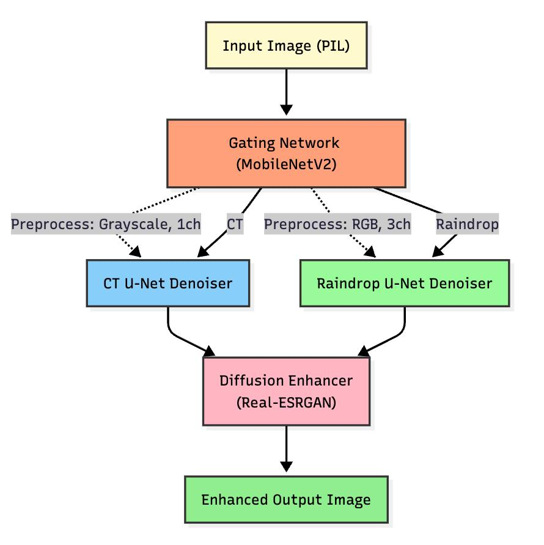
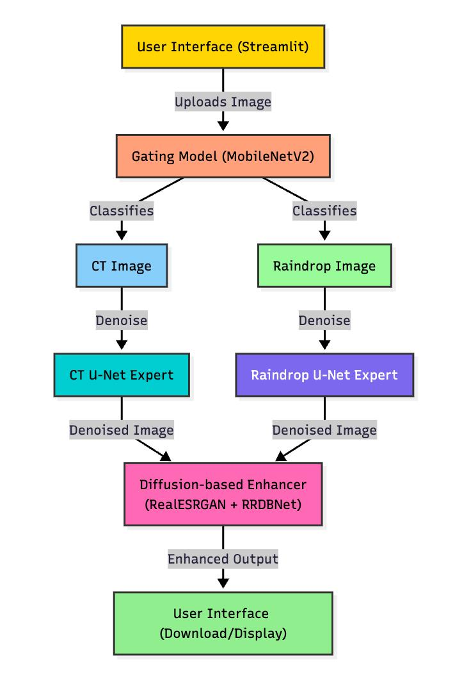

# Spatially Aware Softmixing Diffusion Denoising Model

A sophisticated multi-expert system for image restoration and enhancement using a Mixture of Experts (MoE) architecture with spatially aware softmixing diffusion techniques.

## Overview

This project implements a Spatially Aware Softmixing Diffusion Denoising Model that follows a Mixture of Experts (MoE) workflow for specialized image restoration tasks. The system is designed to handle two distinct types of image degradation:

- **Raindrop Removal**: Restoring images affected by raindrop artifacts
- **Medical Image Enhancement**: Denoising and enhancing CT scan images

## Architecture

The system employs a three-stage pipeline:

1. **Gating Mechanism**: A MobileNetV2-based classifier that determines whether the input image is a raindrop-affected image or a medical (CT) image
2. **Expert Models**: Two specialized UNet models trained for specific restoration tasks
3. **Diffusion Enhancement**: A spatially aware softmixing diffusion model for final image refinement

### System Workflow

```
Input Image → Gating Network → Expert Selection → UNet Denoising → Diffusion Enhancement → Enhanced Output
```

### Architecture Overview



### Workflow Diagram



## Key Features

### Spatially Aware Processing
- The system maintains spatial awareness throughout the pipeline
- Expert models preserve spatial relationships in the restored images

### Softmixing Diffusion
- Advanced diffusion-based enhancement for final refinement
- Smooth blending of denoised features with original spatial information

### Multi-Expert Architecture
- Specialized models for different types of image degradation
- Automatic expert selection based on input characteristics

## Project Structure

The project is organized into modular components:
- **gating/**: Gating mechanism with pre-trained MobileNetV2 classifier
- **experts/**: Specialized UNet models for raindrop and CT image processing
- **enhancer/**: Diffusion-based refinement module
- **training/**: Training scripts and utilities
- **dataset/**: Data handling and paired dataset implementations
- **utils/**: Image processing utilities
- **images/**: Documentation and architecture diagrams

## Installation

### Prerequisites

- Python 3.8 or higher
- CUDA-compatible GPU (optional, for faster training)
- Apple Silicon Mac (M1/M2) support included

### Setup

1. **Clone the repository**
   ```bash
   git clone <repository-url>
   cd SASM
   ```

2. **Create a virtual environment**
   ```bash
   python -m venv .venv
   source .venv/bin/activate  # On Windows: .venv\Scripts\activate
   ```

3. **Install dependencies**
   ```bash
   pip install -r requirements.txt
   ```


## Usage

The system is pre-trained and ready to use for image restoration:

### Process

1. **Input**: Provide any image (raindrop-affected or medical/CT scan)
2. **Automatic Classification**: The gating network automatically determines image type
3. **Expert Processing**: Appropriate UNet expert denoises the image
4. **Diffusion Enhancement**: Final refinement using spatially aware diffusion
5. **Output**: Enhanced, denoised image with improved quality

### Supported Image Types

- **Raindrop Images**: Automatic artifact detection and removal
- **Medical CT Scans**: Noise reduction and diagnostic enhancement

## Technical Specifications

### Architecture Details

| Component | Architecture | Purpose |
|-----------|--------------|---------|
| **Gating Network** | MobileNetV2 | Image classification |
| **Expert UNets** | 4-level Encoder-Decoder | Specialized denoising |
| **Diffusion Model** | Stable Diffusion X4 | Final enhancement |

### Model Parameters

- **Optimizer**: Adam with L1 loss
- **Learning Rate**: 1e-4
- **Batch Size**: Optimized for memory efficiency
- **Device Support**: CUDA, MPS (Apple Silicon), CPU

### Data Structure

```
dataset/data/
├── raindrop/
│   ├── train/clean/     # Clean raindrop images
│   ├── train/noisy/     # Raindrop-affected images
│   ├── val/clean/       # Validation clean images
│   └── val/noisy/       # Validation noisy images
└── medical/
    ├── train/clean/     # Clean CT images
    ├── train/noisy/     # Noisy CT images
    ├── val/clean/       # Validation clean images
    └── val/noisy/       # Validation noisy images
```


## Model Performance

### Expert Model Accuracies
| Model | Accuracy | Specialization |
|-------|----------|----------------|
| **Raindrop Expert UNet** | **98.3%** | Raindrop artifact removal |
| **CT Expert UNet** | **97.2%** | Medical image enhancement |

### Training Specifications
- **Checkpoint Frequency**: Every 5 epochs
- **Final Model**: 100th epoch checkpoint
- **Training Data**: Paired clean/noisy image datasets
- **Optimization**: Adam optimizer with L1 loss

## Results

The system provides significant improvements in image quality:

- **Raindrop Removal**: Effective removal of raindrop artifacts while preserving image details
- **Medical Enhancement**: Clear denoising of CT scans for better diagnostic interpretation
- **Overall Enhancement**: Final diffusion step provides additional quality improvements

## Contributing

1. Fork the repository
2. Create a feature branch (`git checkout -b feature/amazing-feature`)
3. Commit your changes (`git commit -m 'Add amazing feature'`)
4. Push to the branch (`git push origin feature/amazing-feature`)
5. Open a Pull Request

## License

This project is licensed under the MIT License - see the [LICENSE](LICENSE) file for details.

## Acknowledgments

- PyTorch team for the deep learning framework
- Hugging Face for the diffusion models
- The computer vision research community for foundational work

## Contact

For questions and support, please open an issue in the repository.

---

**Note**: This project is designed for research and educational purposes. For medical applications, please ensure compliance with relevant regulations and validation requirements. 